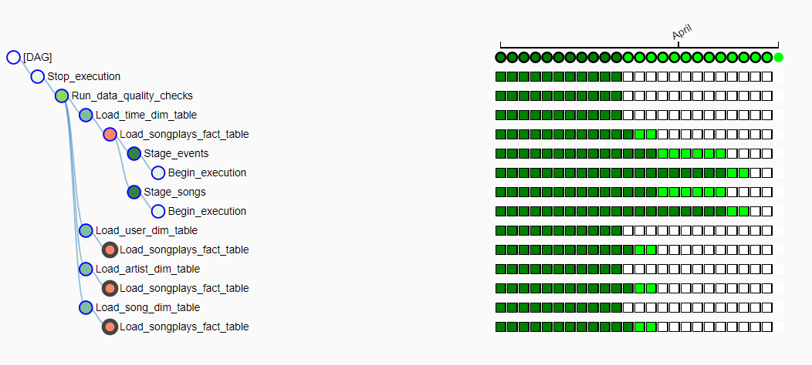

# Project: Data Pipelines with Airflow
A music streaming company, Sparkify, has decided that it is time to introduce more automation and monitoring to their data warehouse ETL pipelines and come to the conclusion that the best tool to achieve this is Apache Airflow.

Project has create high grade data pipelines that are dynamic and built from reusable tasks, can be monitored, and allow easy backfills. They have also noted that the data quality plays a big part when analyses are executed on top the data warehouse and want to run tests against their datasets after the ETL steps have been executed to catch any discrepancies in the datasets.

The source data resides in S3 and needs to be processed in Sparkify's data warehouse in Amazon Redshift. The source datasets consist of JSON logs that tell about user activity in the application and JSON metadata about the songs the users listen to.

### Tools Used
 - Python
 - Redshift
 - Airflow
 - S3 

# Instruction 

### Schema for Song Play Analysis
#### Fact Table
 - songplays - records in event data associated     with song plays i.e. records with page NextSong
  songplay_id, start_time, user_id, level, song_id, artist_id, session_id, location, user_agent

#### Dimension Tables
 - users - users in the app user_id, first_name,    last_name, gender, level
 - songs - songs in music database song_id, title, artist_id, year, duration
 - artists - artists in music database artist_id, name, location, lattitude, longitude
 - time - timestamps of records in songplays broken down into specific units start_time, hour, day, week, month, year, weekday

# Files

 - udac_example_dag.py - file where the dag object is called and all the custom operators are called for the making dag

 - create_tables.sql - contain the queries to create the fact and dimension tables

 - data_quality.py - check that the table are passed to redshift completely (check ofr empty record)

 - load_dimension.py - create the dimenstion table from the data

 - load_fact.py - create the fact table from the data

 - stage_redshift - create the staging table from which the fact and dimension tables are created

 - sql_queries.sql - contains the queries that insert the values to the fact and dimension table

  - pic of the tree created while running the dag
      
    

 # Ackowledgement 
  - Udacity
  - AWS